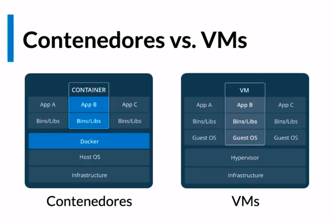
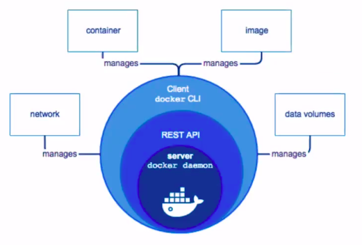

The images provided here are from the [docker course at Platzi](https://platzi.com/cursos/docker/)
# Docker
> "Docker allows to build, distribute and executer any application anywhere" ([Official documentation](https://docs.docker.com/get-started/overview/ "docker docs"))  

Docker allows us to solve the following problems:
- Development environment
- Dependencies
- Running environment
- Productive environment 
- external services
- Distribution
- Repositories divergency
- Artifacts divergency
- Versions
- Executing the software
- Resources (Hardware)

## Virtualization 
Virtualization is the creation of a virtual (rather than actual) version of something, such as an operating system, a server, a storage device or network resources.

>"Virtualization uses software to create an abstraction layer over computer hardware that allows the hardware elements of a single computer, processors, memory, storage and more to be divided into multiple virtual computers" ([IBM](https://www.ibm.com/topics/virtualization "What is virtualization?")) "Each virtual device is represented within its software and user environments as an actual, standalone entity". ([Clinton D](https://medium.com/hackernoon/linux-server-virtualization-the-basics-32079b0e7d6e "linux-server-virtualization-the-basics"), 2017)

### Virtual machine vs Docker
- Virtual machine
  - Emulates a complete computer system
  - Runs a complete operating system
  - Requires a lot of resources
  - Slow
  - Heavy
  - Hard to maintain
- Docker
  - Emulates a process
  - Runs a single process
  - Requires a few resources
  - Fast
  - Light
  - Easy to maintain

## Containers
A container is a standard unit of software that packages up code and all its dependencies so the application runs quickly and reliably from one computing environment to another.

Logic agrupation - whit limitations of access to resources.
Advantages of containers:
- Isolated
- Portable
- Lightweight
- Scalable
- Secure
- Flexible
- Low mating


```bash
docker info
docker version
```

## Docker Architecture


```bash
docker run hello-world
docker ps
docker ps -a # all container regardless it is off
docker inspect {container_id/name}
docker run --name {container_name} {image_name}
docker rm {container_id/name}
docker rm $(docker ps -a -q) # remove all containers
docker container prune # all stopped containers
```

## Iterative mode
```bash
docker run ubuntu
docker run -it ubuntu # keeps the process active
docker run -it --name {container_name} ubuntu
```

## Life cycle of a container
Is the main process running? If not, the container will stop.
```bash
docker run --name {container_name} -d image_name tail -f /dev/null
docker exec -it {container_name} bash
docker inspect --format '{{.State.Pid}}' container_name
kill process_id
```

### Exposing a Container
```bash
docker run --name {container_name} -d -p 8080:80 nginx # {machine_port:container_port}
docker logs container_name 
docker logs -f container_name # follow logs
```

### Bind Mounts
```bash
docker run -d --name {db} mongo
docker exec -it {db} bash
mongo
show dbs
```
    
```bash
docker run -d --name {app} -p 8080:80 -v {path_to_app}:/usr/share/nginx/html nginx
```
### Volumes
Docker is the only that can control the info in the volume
```bash
docker volume ls
docker volume create {volume_name}
docker volume inspect {volume_name}
docker run -d --name {app} --mount src={volume_name},dst=/data/db mongo # that's in the case of being using a mongo image
```
### Inserting files into a container
```bash
docker cp {file_path} {container_name}:{path_to_file_in_the_container}
```
``` bash
docker cp {container_image}:{route_in_the_container} {route_in_the_machine}
```

### Images
Templates.
```bash
docker images ls
docker images ls -a
docker pull image_name
docker rmi image_name
docker rmi $(docker images -a -q) # remove all images
docker image prune # all unused images
```

### Creating an Image
#### Dockerfile
```dockerfile
FROM ubuntu: 22.04
RUN apt update && apt install -y nginx
CMD ["nginx", "-g", "daemon off;"]
```
```bash
docker build -t {image_name} . # . => build context
docker run -d --name {container_name} -p 8080:80 {image_name}
```

```bash
docker login
docker tag {image_name}:{tag} {user_name}/{image_name} # changing the name
docker push {user_name}/{image_name}
```

### Layers system 
```bash
docker history {image_name}
```

### Docker networking
```bash
docker network ls
docker network inspect {network_name}
docker network create --attachable {network_name}
docker network connect {network_name} {container_name}
docker run -d --name {container_name} --network {network_name} {image_name}
docker run -d --name {container_name} --network {network_name} --network-alias {alias} {image_name}
docker run -d --name {container_name} --network {network_name} --network-alias {alias} -p 8080:80 {image_name}
```
### Docker Compose
Docker Compose is a tool for defining and running multi-container Docker applications.
```docker-compose
version: '3'
services:
  db:
    image: mongo
    volumes:
      - dbdata:/data/db
  app:
    build: .
    environment: "route"
    ports:
      - "8080:80"
    depends_on:
      - db
    volumes:
        - .:/usr/share/nginx/html
        - /route/
    command:
        - nginx
        - -g
        - daemon off;
```    

```bash
docker-compose up -d
docker-compose down
docker-compose ps
docker-compose logs
docker-compose logs -f
docker-compose logs -f {service_name}
docker-compose exec {service_name} bash
docker-compose exec {service_name} mongo
docker-compose exec {service_name} mongo -u {user} -p {password} --authenticationDatabase {database}
docker-compose build {service_name}
```
### Compose override
This file allows you override specifications inn the dockerfile
```docker-compose
# docker-compose.override.yml
version: '3'
services:
  app:
    environment:
      - route
    command:
      - nginx
      - -g
      - daemon off;
```
### Administrating your local environment 
```bash
docker container prune
docker rm -f $(docker ps -aq)
docker image prune
docker volume prune
docker system prune
```
```bash
docker run -d --name {container_name} --memory 1gb {image_name}
docker stats
```
### Stopping containers
#### shell vs exec
Exec Form
```dockerfile
CMD ["nginx", "-g", "daemon off;"] # the command runs directly
```
Shell Form
```dockerfile
CMD nginx -g "daemon off;" # the command runs as a child of shell
```

```bash
docker stop {container_name}
docker ps -l
docker kill {container_name}
docker exec {container_name} ps -ef # see the process running in the container
docker exec {container_name} kill {process_id}
```

### Entrypoint vs cmd

```dockerfile
FROM ubuntu:trusty
ENTRYPOINT ["echo"]
CMD ["Hello World"]
```
```bash
docker run {image_name} # Hello World
docker run {image_name} "Hello Platzi" # Hello Platzi
```

```dockerfile
FROM ubuntu:trusty
ENTRYPOINT ["/bin/ping", "-c", "3"]
CMD ["localhost"]
```
```bash
docker run {image_name} # localhost
docker run {image_name} "google.com" # google.com
```

### Build context
```.dockerignore
node_modules
npm-debug.log
```
### Multi-stage build
build folder
- development.Dockerfile
- production.Dockerfile

```dockerfile
# development.Dockerfile

FROM node:12

COPY ["package.json", "package-lock.json", "/usr/src/"]

WORKDIR /usr/src

RUN npm install

COPY [".", "/usr/src/"]

EXPOSE 3000

CMD ["npx", "nodemon", "index.js"]
```

```dockerfile
# production.Dockerfile
FROM node:12 as builder

COPY ["package.json", "package-lock.json", "/usr/src/"]

WORKDIR /usr/src

RUN npm install --only=production

COPY [".", "/usr/src/"]

RUN npm install --only=development

RUN npm run test


# Productive image
FROM node:12

COPY ["package.json", "package-lock.json", "/usr/src/"]

WORKDIR /usr/src

RUN npm install --only=production

COPY --from=builder ["/usr/src/index.js", "/usr/src/"]

EXPOSE 3000

CMD ["node", "index.js"]
```

```bash
docker build -f development.Dockerfile -t {image_name} .
docker build -f production.Dockerfile -t {image_name} .
```
### Docker-in-Docker
```bash
docker run -d --rm --name {container_name} -v /var/run/docker.sock:/var/run/docker.sock docker:stable-dind
docker exec -it {container_name} sh
docker ps
```
